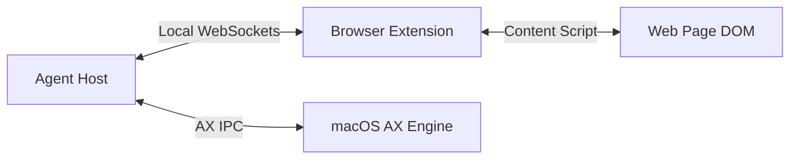
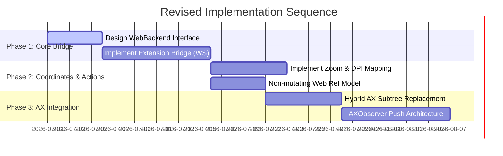

# Critical Architecture Review: Fast macOS & Web Automation

---

## 1. Executive Summary & Verdict

The core thesis of the plan is correct: **Accessibility (AX) IPC is the wrong tool for web automation** and must be replaced to achieve sub-second execution loops. 

However, the proposed implementation—relying on **Safari Apple Events (`do JavaScript`)** and **DOM-mutating tracking refs (`data-mcp-ref`)**—introduces significant fragility, security risks, and high-friction configuration barriers. Furthermore, the plan underestimates the latency overheads of the Apple Event loop itself and the cognitive processing limits of the LLM parser.

**Verdict:** Proceed with the hybrid AX/Web architecture, but **discard the Apple Events approach in favor of a Browser Extension/WebSocket bridge**, and **avoid mutating the DOM for element references**.

---

## 2. End-to-End Speed & Remaining Bottlenecks

While bypassing AX tree walks on web pages will drastically reduce perception time, several hidden latency bottlenecks remain unaddressed:

*   **Apple Event Execution Overhead:** Spawning AppleScripts or executing Apple Events via native APIs (`NSAppleEventDescriptor`) is not free. It is single-threaded in the target app, blocked by application-modal sheets (e.g., file dialogs, alerts), and typically has a baseline execution time of **30ms to 100ms** per call, even for empty scripts.
*   **LLM Inference & Token Processing Latency (The True Bottleneck):** If the `web_snapshot` returns a DOM tree of 1,000+ interactive elements, the LLM context size increases by tens of thousands of tokens. Processing this payload and generating the next action takes the LLM **800ms to 2500ms** depending on the model. Minimizing AX/web IPC to 100ms is wasted if the LLM payload is not aggressively pruned and optimized.
*   **Sequential Fallbacks:** The "JS-click with trusted-click fallback" strategy implies that if a synthetic click fails, the system waits for a timeout, recalculates coordinates, and fires a `CGEvent`. This fallback flow will spike step latency to **>1.5 seconds** when it occurs.
*   **AXObserver Overhead:** Subscribing to native AX notifications (especially `AXLayoutChanged` and `AXValueChanged` on complex apps) can cause high CPU utilization and main-thread stuttering in the host automation runner.

---

## 3. Web Bridge Evaluation: Apple Events vs. Alternatives

The plan recommends Safari Apple Events (`do JavaScript`) because it requires "no extension, no WebDriver, no debugging port." This is a false optimization. 

### Why Apple Events `do JavaScript` is Fragile
1.  **Security Risk:** Enabling "Allow JavaScript from Apple Events" opens a system-wide security hole. Any script running on the machine (even unprivileged ones) can read session tokens, passwords, and private data out of the user's Safari tabs.
2.  **UI Blocking:** If Safari displays a native modal (e.g., "This site wants to send notifications" or a print sheet), Apple Events block completely and timeout, rendering the agent blind and unresponsive.
3.  **Cross-Browser Incompatibility:** AppleScript support in Google Chrome, Arc, and Microsoft Edge is highly inconsistent and often disabled or restricted by IT policies.

### The Alternative: Browser Extension Bridge (WebSockets / Native Messaging)
Instead of Apple Events, implement a lightweight cross-browser extension.

*   **Performance:** WebSocket communication between the host agent and a content script executes in **<2ms**, completely bypassing the slow AppleScript engine.
*   **Stability:** It is unaffected by native Safari modal dialogs.
*   **Cross-Origin Iframes:** By declaring appropriate host permissions, the extension can automatically inject scripts into nested, cross-origin iframes, solving the iframe limitation natively.
*   **Zero Configuration:** Does not require the user to toggle hidden developer menus, check security-sensitive boxes, or manage OS-level automation permissions (TCC) for scripting Safari.

---

## 4. Technical Risks & Deep Dive

### Ref Mutation Stability & SPA Hydration
Stamping elements with `data-mcp-ref="w42"` mutates the DOM. 
*   **The Risk:** Modern Single Page Application (SPA) frameworks (React, Vue, Svelte) track the DOM state closely. External mutations can trigger hydration mismatches, break virtual-DOM diffing, or cause the framework to instantly wipe the custom attribute during state changes, resulting in stale reference errors.
*   **The Fix:** Store elements in a WeakMap on the window object (e.g., `window.__mcp_registry`) and assign temporary, non-mutating numeric indices. Map them back to selectors or stable XPath references if the element is unmounted.

### Coordinate, Zoom, and DPI Mapping
Translating a JS-derived bounding rect to a physical `CGEvent` click target is highly error-prone:
*   **Retina Display Scaling:** Bounding rects are in CSS pixels, whereas `CGEventCreateMouseEvent` requires screen coordinates in Point coordinates (and occasionally physical pixels depending on the API).
*   **Browser Window Framing:** The window title bar, tab bar, bookmark bar, and side panels constantly shift the origin of the web canvas. Simply adding the `AXWebArea` screen frame is insufficient if the page is zoomed or if the browser window uses responsive layouts.
*   **Scroll Interleaving:** If a user scrolls the page between the snapshot execution and the action execution, the cached coordinates become invalid.

### Permissions, TCC, and Security
Automation via Apple Events requires the host application to prompt for System Events control. TCC (Transparency, Consent, and Control) dialogs on macOS are notoriously frustrating for users. If a user rejects the prompt once, the app fails silently. Resetting it requires terminal execution (`tccutil`), which introduces significant onboarding friction.

---

## 5. What the Plan is Missing

1.  **Tab and Window Synchronization:** The plan does not detail how the agent tracks which Safari window or tab is currently active. If the user manually switches tabs mid-execution, the agent may inject scripts or fire events into the wrong page context.
2.  **Input Focus Management:** For inputs and textareas, synthetic events (`.value = ...`) do not trigger standard browser behaviors like autocompletion, validation, or form-submission activations. The system must explicitly call `.focus()` and dispatch `input`, `change`, and `keydown` events in the exact sequence expected by modern web forms.
3.  **Hover State Simulation:** Many interactive menus only render on hover. A simple `click` target is not enough; the system needs a `web_hover` event to trigger CSS `:hover` states and JS mouseover listeners before clicking.

---

## 6. Recommended Sequencing & Phases

The original phases prioritize the Safari JS Apple Event bridge. To mitigate the risks identified above, the phases should be restructured to prioritize the bridge interface abstraction and coordinate resolution.

### Phase 1: Core Bridge Interface & WebSocket Extension
*   Define the `WebBackend` interface to abstract the communication layer.
*   Build the WebSocket-based browser extension. This ensures early support for Chrome, Arc, and Safari, and resolves security and iframe concerns from day one.

### Phase 2: Coordinate & Action Calibration
*   Resolve DPI, scale, scroll state, and browser chrome offsets.
*   Build a non-mutating WeakMap registry for element reference tracking.

### Phase 3: Hybrid AX Integration & Observers
*   Implement the subtree replacement logic inside `control_app`.
*   Integrate `AXObserver` to handle the native application state pushes.
